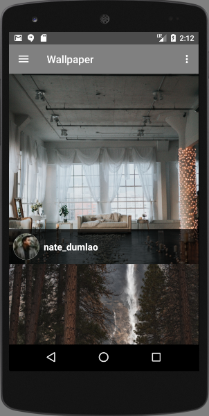
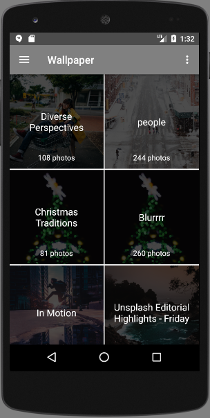
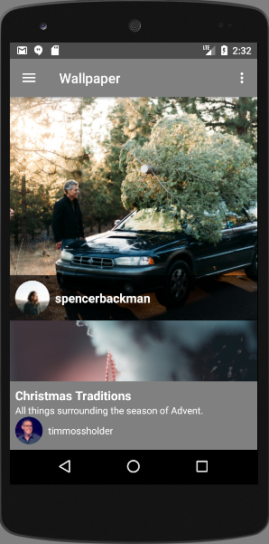
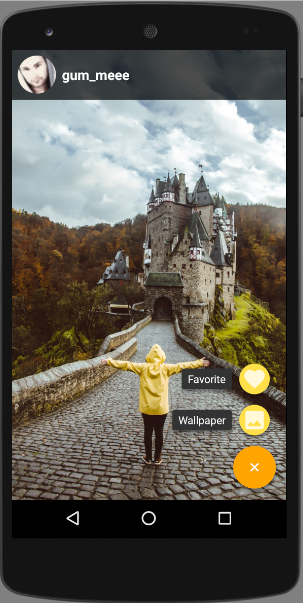

# Advanced Android: Create a Real-REST API Client Application

##### Quick Course to learn how to build a beautiful Wallpaper Android App with Retrofit, GSON, Realm, ButterKnife, Glide

## What our application looks like ?

  
  
  
  

## Description
**Every developers want to build a REAL THING, a REAL APPLICATION not just something for learning.**
